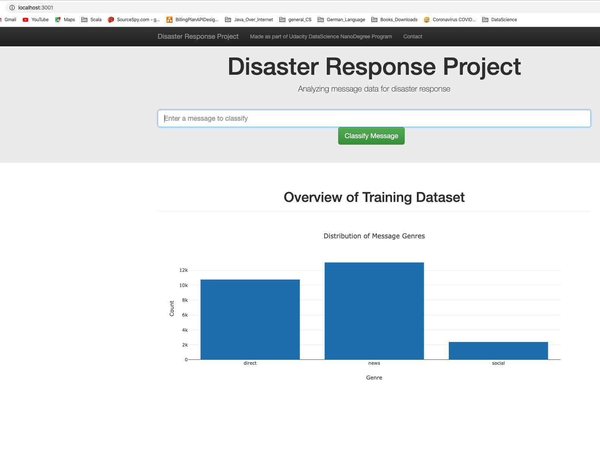
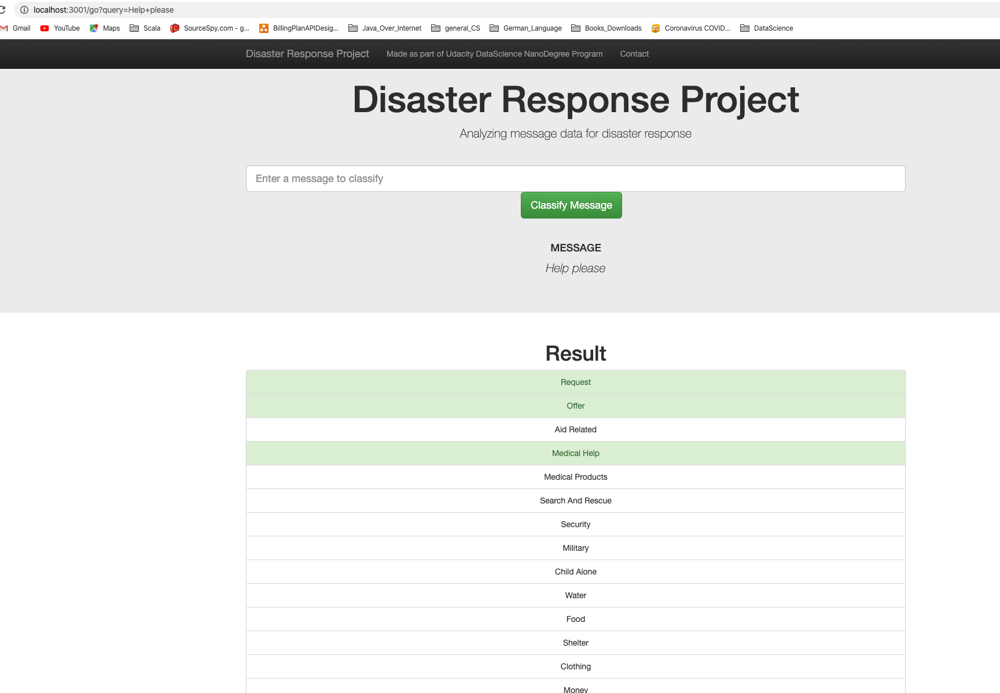

## 1. Installation
- scikit-learn == 0.22.2.post1
- nltk == 3.4.5
- Flask == 1.1.2
- plotly == 4.6.0
- SQLAlchemy == 1.3.16
- numpy == 1.18.2      
- pandas == 1.0.3

I have used Python version 3.7.7 in my local machine. However, code should run for any Python version 3.*.

## 2. Project Description

This project is a simple flask web application. It provides the results of the machine learning model.
This machine learning model classifies different messages collected during various natural/human-made disasters from various localities.
It aims to classify each message to the correct target category. The idea is to provide targeted help as quickly as possible during the future natural disasters to citizens affected. The data is provided by Figure Eight in collaboration with Udacity as part of Data Science Nanodegree Program.

## 3. File Descriptions    

> * **data/disaster_messages.csv data/disaster_categories.csv :** original data
> * **data/process_data.py:** ETL pipeline that cleans data and stores in database
> * **data/DisasterResponse.db:** database that stores cleaned data
> * **models/train_classifier.py:** ML pipeline that trains classifier and saves model
> * **models/classifier.pkl:** a pickle file which saves model
> * **models/Evaluation_Linear_SVC.md:** Results of Linear SVC model evaluation on my local machine
> * **models/Evaluation_Random_Forest.md:** Results of RandomForestClassifier model evaluation on my local machine
> * **app/:** a Flask framework for presenting data (two screenshots shows correct working connection string in app/run.py file)

## 4. Project Structure
- \
	- README.md

- \app
	- run.py
	- \templates
	   - go.html
	   - master.html
- \data
	- DisasterResponse.db
	- disaster_categories.csv
	- disaster_messages.csv
	- process_data.py
- \models
	- classifier.pkl : Model is not included in this GitHub repo, due to size limitations. You can generate model by running 'train_classifier.py'
	- train_classifier.py
	- Evaluation.md : Provide results of evaluation for trained model on my local machine (RandomForestClassifier)

## 5. How to Run?

     1. Run the following commands in the project's root directory to set up your database and model.

         - To run ETL pipeline that cleans data and stores in database
             `python data/process_data.py data/disaster_messages.csv data/disaster_categories.csv data/DisasterResponse.db`
         - To run ML pipeline that trains classifier and saves
             `python models/train_classifier.py data/DisasterResponse.db models/classifier.pkl`

     2. Run the following command in the app's directory to run your web app.
         `python run.py`

     3. Go to http://0.0.0.0:3001/

## 6. GitHub Repo:
   - https://github.com/hardik101/dsnd-project-2

## 7. Web Application Screenshots:

	 1.

	 2.

## 8. Licensing, Author, Acknowledgements
This work is licensed under a [Creative Commons  Attribution-NonCommercial-NoDerivatives 4.0 International License](http://creativecommons.org/licenses/by-nc-nd/4.0/). Please refer to [Udacity Terms of Service](https://www.udacity.com/legal) for further information.

Signed-off by : Hardik B.
